 **Nassi-Shneiderman Diagrams** are diagrams illustrating the control flow structure within a module using nested blocks. These diagrams are used to represent structured schemes and help reduce the complexity of diagrams by not explicitly indicating control flow lines. Nassi-Shneiderman diagrams are also known as structure charts.

 The depiction of the basic elements of structured programming in Nassi-Shneiderman diagrams is organized as follows. Each block is represented by a rectangle and can be nested within the inner rectangle of any other block. Information about the blocks is written following the same rules as in structured algorithm schemes (using natural language or the language of mathematical sciences).

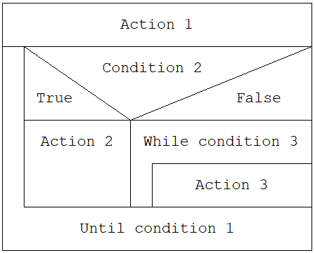

1. Functional block (processing block) is represented as a regular rectangle. Each rectangle inside any symbol is also a processing block.

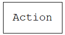

2. Simple branching (IF block) is represented as a rectangle divided by a horizontal line into two parts. The upper part contains the branching header, while the lower part consists of two branching branches separated by a vertical line. In the header, two lines are drawn from the upper corners to the start of the line that separates the branches. In the resulting triangle at the top, the branching condition is written, and in the two lower triangles above the branches, the condition values corresponding to those branches are labeled, for example, "true" and "false" or "yes" and "no".

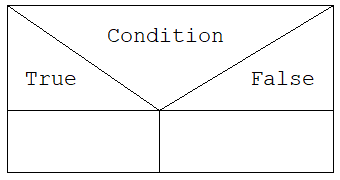

3. Multiple branching (CASE block) is represented similarly to the structure of simple branching, but the main branch and the triangle above it are divided into multiple parts by vertical lines. In the upper triangle, the switch expression is written, and above the branches, the corresponding switch values are labeled. The last column represents the "Otherwise" branch, which is executed if none of the branches satisfy the condition.

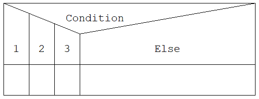

4. A loop with a precondition is represented as a rectangle, inside which another rectangle is drawn in the bottom right corner. The loop header is written above the inner rectangle, and the loop body is written inside it.

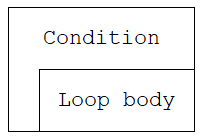

5. A loop with a postcondition differs from a loop with a precondition only in the placement of the inner rectangle, which is drawn in the top right corner of the outer rectangle. The header is written below it.

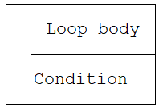

When the program is launched, the diagram starts as empty, consisting of a single empty block. To begin working, you need to select this block by left-clicking on it or using the arrow keys on the keyboard. After that, you can add a new block or modify the existing one. You can also use the right mouse button to open a context menu that contains the same options.

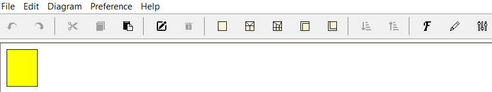

When you hold down the mouse button while selecting a block, you can effortlessly move it to a different location. The areas where the block can be placed will be elegantly highlighted in green upon mouse hover, indicating valid drop zones. If you release the mouse button while the block is positioned above a green-highlighted area, the block will seamlessly relocate itself to the designated spot.

There are three possible scenarios when moving a block:

1. Add the block after the target block: Simply release the mouse button when the block is above a green-highlighted area.

  
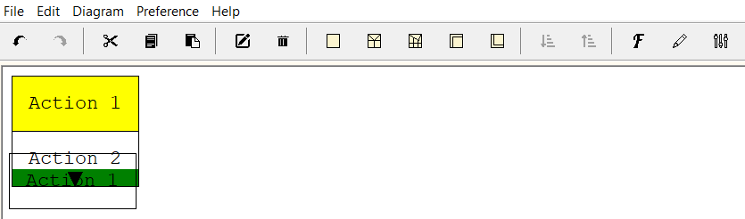

2. Place the block before the target block: Hold down the Ctrl key while releasing the mouse button when the block is above a green-highlighted area.

  
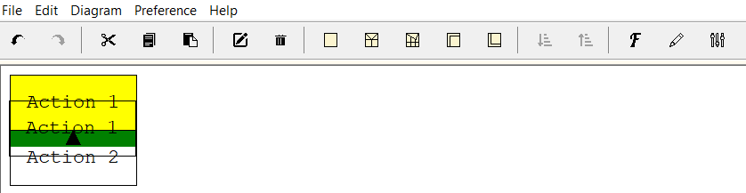

3. Swap positions with the target block: Hold down the Shift key while releasing the mouse button when the block is above a green-highlighted area.

  
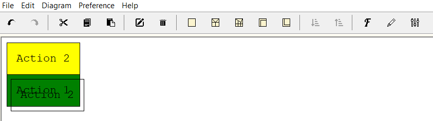

To edit a specific block, you can double-click the block with the left mouse button or use the "Edit Block" button in the "Edit" menu, the right-click context menu, or the top toolbar. This will open the editing window. The main input field contains the text of the block.

If the operator is a case statement, you need to provide conditions for it. You can use the "+" and "-" buttons to add or remove input fields. Please note that you cannot remove a field if there are only two fields remaining.

Export options available in: PNG, BMP, SVG.

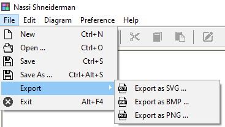